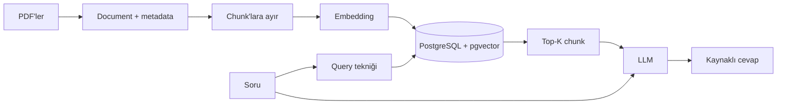

# 📚 PDF RAG Asistanı (PDF_RAG_Assistant)

PDF dosyalarını yükleyip bunlar hakkında soru sorabileceğin, **Streamlit + LangChain + PostgreSQL (pgvector)** tabanlı bir RAG uygulaması. Cevaplar yalnızca yüklenen dokümanlara dayanır ve kaynaklar (dosya, sayfa, chunk metni) cevabın altında gösterilir.

> Bu proje, **Tirendaz Academy AI Engineering Bootcamp – 2. Cohort** kapsamında RAG konusu için hazırlanan bir ders ödevidir.

🎬 **Demo:** [Demo videosu](BURAYA_VIDEO_LINKI_EKLE)

## ✨ Özellikler

- **Çoklu PDF yükleme:** Birden fazla PDF aynı anda indekslenir. Her sayfa `source` (dosya adı) ve `page` metadata'sıyla saklanır.
- **Ayarlanabilir chunking:** `RecursiveCharacterTextSplitter` ile chunk size ve overlap (% olarak) arayüzden belirlenir.
- **5 farklı arama tekniği:**

  | Teknik | Nasıl çalışır? |
  |---|---|
  | **Basic** | Soru doğrudan vektör DB'de aranır |
  | **Rewrite-Retrieve** | LLM soruyu arama için yeniden yazar, sonra aranır |
  | **Multi Query** | LLM sorunun birkaç versiyonunu üretir, sonuçlar birleştirilir |
  | **RAG-Fusion** | Multi Query sonuçları Reciprocal Rank Fusion ile yeniden sıralanır |
  | **HyDE** | LLM varsayımsal bir cevap yazar, bu metinle arama yapılır |

- **Metadata filtresi:** Aramayı yalnızca seçilen dosyalarla sınırlayabilirsin.
- **Kaynaklı cevap:** Cevap akarak gelir; kaynaklar ve tekniğin ürettiği ara sorgular genişletilebilir kutuda görünür.
- **Tekrar yüklemede çoğalma yok:** Aynı PDF yeniden indekslenirse kayıtlar çoğalmaz.

## 🧠 RAG akışı



1. **İndeksle:** PDF → Document → chunk'lar → embedding → vektör veritabanı
2. **Yakala:** Seçilen sorgu tekniğiyle ilgili chunk'lar getirilir
3. **Üret:** LLM, yalnızca getirilen bağlama dayanarak cevap verir

## 🛠️ Kullanılan teknolojiler

Python · Streamlit · LangChain · OpenAI (LLM ve embedding) · PostgreSQL + pgvector · Docker

## 🚀 Çalıştırma

**Gereksinimler:** Python 3.10+, Docker, OpenAI API key

```bash
docker compose up -d
pip install -r requirements.txt
streamlit run app.py
```

Uygulama `http://localhost:8501` adresinde açılır. OpenAI API key'ini sol menüden gir ya da `OPENAI_API_KEY` ortam değişkeni olarak ver.

## 📖 Kullanım

1. **Dokümanlar** sekmesinde bir veya birden fazla PDF seçip **İndeksle**'ye tıkla.
2. **Sohbet** sekmesine geç; istersen aranacak dosyaları seç.
3. Kenar çubuğundan arama tekniğini seç ve sorunu yaz.
4. **Kaynaklar** bölümünden cevabın hangi dosya ve sayfalardan geldiğini gör.

## 📁 Proje yapısı

```
├── app.py               # Streamlit uygulaması
├── requirements.txt     # Python bağımlılıkları
├── docker-compose.yml   # pgvector destekli PostgreSQL (localhost:6024)
└── README.md
```

## ⚠️ Notlar

- Uygulamayı başlatmadan önce **Docker açık** olmalı ve `docker compose up -d` çalışmış olmalı.
- Chunk size/overlap değiştirirsen PDF'leri **yeniden indekslemen** gerekir.
- Taranmış (görsel) PDF'lerde metin çıkarılamaz, önce OCR uygulanmalıdır.
- **API key'ini repoya commit etme.** Ortam değişkeni ya da `.env` kullan ve `.env` dosyasını `.gitignore`'a ekle.
- Proje yerel kullanım için tasarlandı. Public yayın için veritabanının ve oturum yönetiminin ayrıca kurgulanması gerekir (herkes aynı collection'ı paylaşır).
